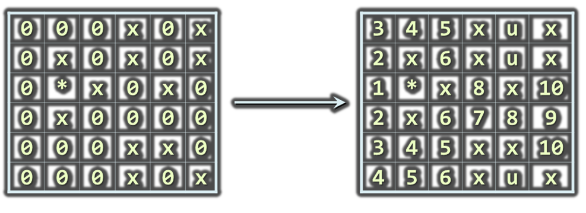

## Linear Data Structures Homework

1. Write a program that reads from the console a sequence of positive integer numbers.
  - The sequence ends when empty line is entered.
  - Calculate and print the sum and average of the elements of the sequence.
  - Keep the sequence in `List<int>`.

2. Write a program that reads N integers from the console and reverses them using a stack.
  - Use the `Stack<int>` class.

3. Write a program that reads a sequence of integers (`List<int>`) ending with an empty line and sorts them in an increasing order.

4. Write a method that finds the longest subsequence of equal numbers in given List<int> and returns the result as new `List<int>`.
  - Write a program to test whether the method works correctly.

5. Write a program that removes from given sequence all negative numbers.
 
6. Write a program that removes from given sequence all numbers that occur odd number of times.
  - _Example_:
      - `{4, 2, 2, 5, 2, 3, 2, 3, 1, 5, 2}` &rarr; `{5, 3, 3, 5}`

7. Write a program that finds in given array of integers (all belonging to the range [0..1000]) how many times each of them occurs.
  - Example: `array = {3, 4, 4, 2, 3, 3, 4, 3, 2}`
    - 2 &rarr; 2 times
    - 3 &rarr; 4 times
    - 4 &rarr; 3 times

8. *The majorant of an array of size N is a value that occurs in it at least N/2 + 1 times.
  - Write a program to find the majorant of given array (if exists).
  - Example:
    - `{2, 2, 3, 3, 2, 3, 4, 3, 3}` &rarr; `3`

9. We are given the following sequence:
  - `S1 = N;`
  - `S2 = S1 + 1;`
  - `S3 = 2*S1 + 1;`
  - `S4 = S1 + 2;`
  - `S5 = S2 + 1;`
  - `S6 = 2*S2 + 1;`
  - `S7 = S2 + 2;`
  - ...
  - Using the `Queue<T>` class write a program to print its first 50 members for given N.
  - Example: `N=2` &rarr; `2, 3, 5, 4, 4, 7, 5, 6, 11, 7, 5, 9, 6, ...`

10. We are given numbers N and M and the following operations:
  * `N = N+1`
  * `N = N+2`
  * `N = N*2`

  - Write a program that finds the shortest sequence of operations from the list above that starts from `N` and finishes in `M`.
  - _Hint_: use a queue.
  - Example: `N = 5`, `M = 16`
  - Sequence: 5 &rarr; 7 &rarr; 8 &rarr; 16

11. Implement the data structure linked list.
  - Define a class `ListItem<T>` that has two fields: `value` (of type `T`) and `NextItem` (of type `ListItem<T>`). 
  - Define additionally a class `LinkedList<T>` with a single field `FirstElement` (of type `ListItem<T>`).

12. Implement the ADT `stack` as auto-resizable array.
  - Resize the capacity on demand (when no space is available to add / insert a new element).

13. Implement the ADT `queue` as dynamic linked list.
  - Use generics (`LinkedQueue<T>`) to allow storing different data types in the queue.

14. (*) We are given a labyrinth of size N x N.
  - Some of its cells are empty (`0`) and some are full (`x`).
  - We can move from an empty cell to another empty cell if they share common wall.
  - Given a starting position (`*`) calculate and fill in the array the minimal distance from this position to any other cell in the array. Use "`u`" for all unreachable cells. 
  - _Example_:

