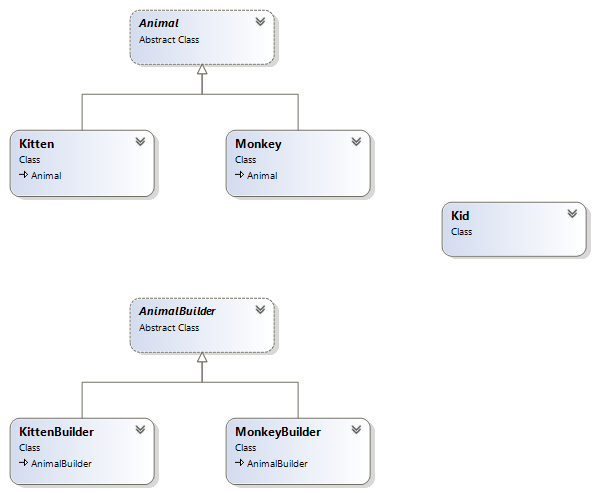

# Builder
### Creational Design Pattern

## Обобщение
Builder Pattern-ът разделя логиката по създаването на обекта от използването му. Така един и същи процес на конструиране
може да създаде обекти с различни данни.
Този шаблон енкапсулира и опростява създаването на обекта. Благодарение на него се избяга подаване на голям брой параметри,
order dependency и множество конструктори.

Шаблонът си служи с Director, абстрактен Builder (определя логиката по създаването, последователността) и конкретен Builder,
който отговаря за конкретната имплементация на създаването.

## Конкретна имплементация
Builder за конструиране на животни:

###### Animal
~~~c#
public abstract class AnimalBuilder
{
	public Animal animal;

	public abstract void BuildAnimalHeader();
	public abstract void BuildAnimalBody();
	public abstract void BuildAnimalLeg();
	public abstract void BuildAnimalArm();
	public abstract void BuildAnimalTail();
}

public class MonkeyBuilder : AnimalBuilder
{
	public MonkeyBuilder()
	{
		animal = new Monkey();
	}

	public override void BuildAnimalHeader()
	{
		animal.Head = "Moneky's Head has been built";
	}

	public override void BuildAnimalBody()
	{
		animal.Body = "Moneky's Body has been built";
	}

	public override void BuildAnimalLeg()
	{
		animal.Leg = "Moneky's Leg has been built";
	}

	public override void BuildAnimalArm()
	{
		animal.Arm = "Moneky's Arm has been built";
	}

	public override void BuildAnimalTail()
	{
		animal.Tail = "Moneky's Tail has been built";
	}

}

public class KittenBuilder : AnimalBuilder
{
	public KittenBuilder()
	{
		animal = new Kitten();
	}

	public override void BuildAnimalHeader()
	{
		animal.Head = "Kitten's Head has been built";
	}

	public override void BuildAnimalBody()
	{
		animal.Body = "Kitten's Body has been built";
	}

	public override void BuildAnimalLeg()
	{
		animal.Leg = "Kitten's Leg has been built";
	}

	public override void BuildAnimalArm()
	{
		animal.Arm = "Kitten's Arm has been built";
	}

	public override void BuildAnimalTail()
	{
		animal.Tail = "Kitten's Tail has been built";
	}
}

 public abstract class Animal
{

	public Animal()
	{
	}

	public string Head { get; set; }
	public string Body { get; set; }
	public string Leg { get; set; }
	public string Arm { get; set; }
	public string Tail { get; set; }

	//helper method for demo the Polymorphism, so we can 
	//easily tell what type object it is from client.
	public abstract void Eat();

	//helper method for demo the result from client
	public void ShowMe()
	{
		Console.WriteLine(Head);
		Console.WriteLine(Body);
		Console.WriteLine(Leg);
		Console.WriteLine(Arm);
		Console.WriteLine(Tail);
		Eat();
	}

}

public class Monkey : Animal
{
	public Monkey()
		:base()
	{
	}

	//helper method to show monkey's property for demo purpose
	public override void Eat()
	{
		Console.WriteLine("Since I am Monkey, I like to eat banana");
	}

}

class Kitten : Animal
{
	public Kitten()
		: base()
	{
	}

	public override void Eat()
	{
		Console.WriteLine("Since I am Kitten, I like to eat kitten food");
	}
}

 public class Kid
{
	public Kid(string name)
	{
		this.Name = name;
	}

	public string Name { get; set; }
	
	public void MakeAnimal(AnimalBuilder aAnimalBuilder)
	{
		aAnimalBuilder.BuildAnimalHeader();
		aAnimalBuilder.BuildAnimalBody();
		aAnimalBuilder.BuildAnimalLeg();
		aAnimalBuilder.BuildAnimalArm();
		aAnimalBuilder.BuildAnimalTail();
	}
}

public class Main
{
	static void Main(string[] args)
	{
		
		Kid kid = new Kid("Stamat4o");
		
		Console.WriteLine("{0} start making a monkey", kid.Name);
		AnimalBuilder builderA = new MonkeyBuilder();
		kid.MakeAnimal(builderA);
		builderA.animal.ShowMe();

		Console.WriteLine(new string('-', 50));

		Console.WriteLine("{0} start making a kitten", kid.Name);
		AnimalBuilder builderB = new KittenBuilder();
		kid.MakeAnimal(builderB);
		builderB.animal.ShowMe();

		Console.Read();
	}
}
~~~
